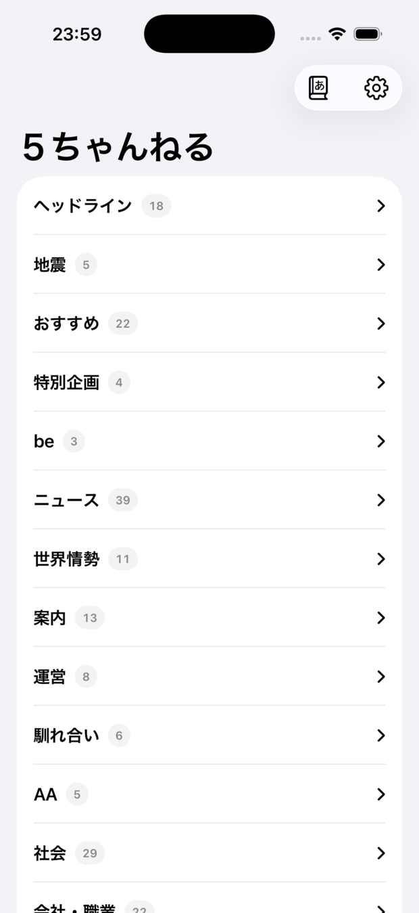
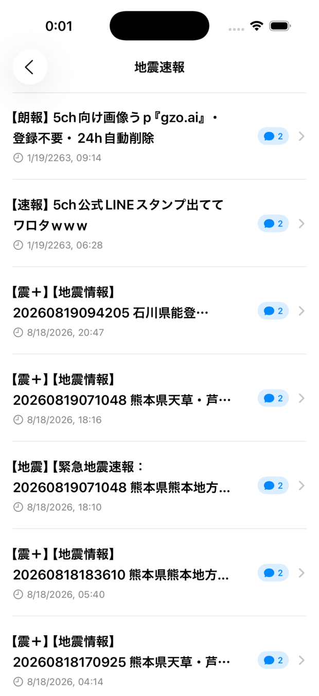
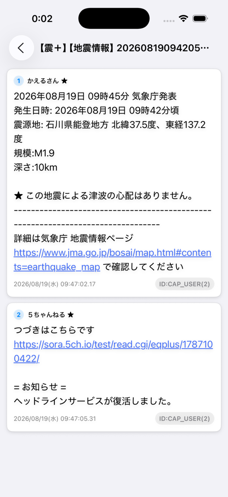
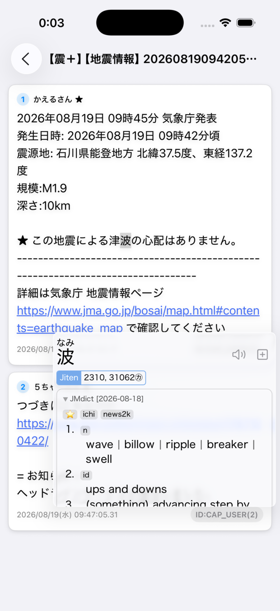
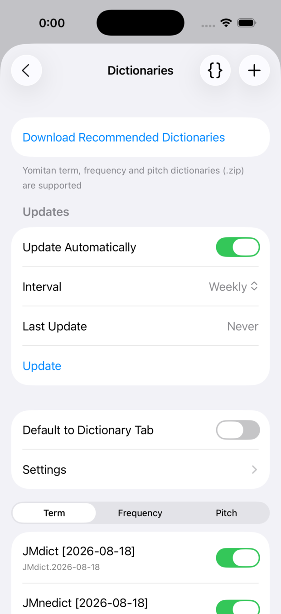

<div align="center">


# Donguri


**Donguri** (どんぐり — "acorn") is a 5ちゃんねる reader for iOS with a Yomitan-style
pop-up dictionary and Anki integration, made for reading 5ch as immersion practice.

Essentially [Hoshi Reader](https://github.com/Manhhao/Hoshi-Reader) for 5ch instead of EPUBs.

<p align="center">
    
    
    
    
</p>

</div>

## Features

<div align="left">

- **Tap any word in a post** to look it up — Yomitan-style pop-up dictionary with
  **deinflection support** (tapping 食べさせられた finds 食べる)
- Support for **all** Yomitan term, frequency and pitch dictionaries
- One-tap **Anki mining** via AnkiMobile or AnkiConnect, with the core handlebars
  used by [Lapis](https://github.com/donkuri/lapis)
- **Audio** for Yomitan online audio sources
- Standalone dictionary search
- Full 5ch browsing: board menu → boards → threads, with `dat` and `read.cgi`
  archive support (so dat落ち threads still open)
- Reply previews, read-position tracking and per-thread unread counts
- Tap an ID or tripcode to highlight every post by that poster
- Inline image thumbnails with a pinch-zoom fullscreen viewer

</div>

## Getting started

Donguri ships with no dictionaries. On first run, open **⚙︎ → 辞書 → Download
Recommended Dictionaries** to fetch JMdict, JMnedict and the Jiten frequency list
(~33 MB), or use **+** to import any Yomitan dictionary `.zip`.

<p align="center">
    
</p>

For Anki, open **⚙︎ → Anki**. AnkiConnect works over HTTP; AnkiMobile is driven
via `x-callback-url` and needs the app installed on the same device.

## Building

Requires Xcode 26+ and an iOS 26 simulator or device.

```bash
xcodebuild -project Donguri.xcodeproj -scheme Donguri -sdk iphonesimulator -destination 'generic/platform=iOS Simulator' build
```

Swift package dependencies ([hoshidicts](https://github.com/Manhhao/hoshidicts),
ZIPFoundation) resolve automatically.

## Credits

Donguri's dictionary and Anki functionality is **ported from
[Hoshi Reader](https://github.com/Manhhao/Hoshi-Reader)** by
[Manhhao](https://github.com/Manhhao), licensed under GPL-3.0-or-later. Ported
files retain their original copyright and SPDX headers.

| Donguri | Origin in Hoshi Reader |
| --- | --- |
| `View/Popup/popup.js`, `popup.css` | `Features/Popup/` (verbatim) |
| `View/Popup/selection.js` | `Features/Reader/ReaderWebView/selection.js` (verbatim) |
| `View/Popup/PopupView.swift`, `PopupWebView.swift` | `Features/Popup/` |
| `View/Popup/WordAudioPlayer.swift` | `Features/Popup/` (© HuangAntimony) |
| `View/Dictionary/` | `Features/Dictionary/` |
| `View/Settings/AnkiView.swift`, `AnkiConnectView.swift`, `CSSEditorView.swift`, `DictionaryView.swift` | `Features/Settings/` |
| `Service/AnkiManager.swift`, `DictionaryManager.swift`, `LookupEngine.swift`, `UserConfig.swift` | `Core/` |
| `Service/AppFileStorage.swift` | `Core/BookStorage.swift` (trimmed to generic file helpers) |
| `Model/Anki.swift`, `Model/Dictionary.swift` | `Models/` |
| `Extensions/CSSSanitizer.swift`, `Popup+Extensions.swift` | `Util/` |

The dictionary engine is [hoshidicts](https://github.com/Manhhao/hoshidicts), also
by Manhhao, consumed as a Swift package. Donguri drives its **C API**
(`hoshidicts_c.h`) rather than the C++ API Hoshi Reader uses, because Swift's C++
interop cannot import the engine's move-only `DictionaryQuery`.

Not ported (EPUB-specific): the reader itself, pagination and vertical writing,
fonts, highlights, statistics, ッツ Reader / Google Drive sync, and Sasayaki.

`View/Popup/PostTextWebView.swift` is new to Donguri — 5ch posts render in a
`WKWebView` so `selection.js` can hit-test individual characters, which SwiftUI's
`Text` cannot do.

## Licence

GPL-3.0-or-later — see [LICENSE](LICENSE). Donguri is a derivative work of Hoshi
Reader and is distributed under the same licence.
